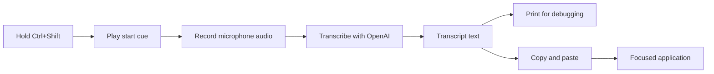

# Voicer

An X11 push-to-talk voice-input utility. Hold **Ctrl+Shift** to play a short
recording-start cue and begin capture; on release, Voicer transcribes your
speech, prints the result for debugging, and uses Ctrl+V to paste it into the
focused application. It never presses Enter.

## Requirements

- Linux running an X11 session
- Python 3.12+
- An OpenAI API key
- `libportaudio2`, `xclip`, and `xdotool`

On Ubuntu/Debian:

```bash
sudo apt-get install libportaudio2 xclip xdotool
```

## Setup

```bash
python3 -m venv .venv
.venv/bin/python -m pip install --editable .
cp .env.example .env
```

Add your API key to `.env`:

```dotenv
OPENAI_API_KEY=your_api_key
```

## Run

```bash
.venv/bin/python app.py
```

Focus the target text field, hold Ctrl+Shift while speaking, then release a
key.

## Architecture

Voicer is one small pipeline:



In plain terms, the app has six jobs:

1. **Hotkey:** detects when you press and release Ctrl+Shift.
2. **Start cue:** plays the bundled sound before recording begins.
3. **Recorder:** captures your microphone while the keys are held.
4. **Transcriber:** sends the finished recording to OpenAI and receives text.
5. **Paster:** copies that text and sends Ctrl+V to the focused app.
6. **Controller:** connects the steps in order and keeps the app responsive
   while transcription happens in the background.

The files are separated only to keep future changes small. Supporting another
platform mainly means replacing the hotkey and paste code; switching to a
different speech-to-text provider mainly means replacing the transcriber. The
core flow stays: **cue, record, transcribe, paste**.
